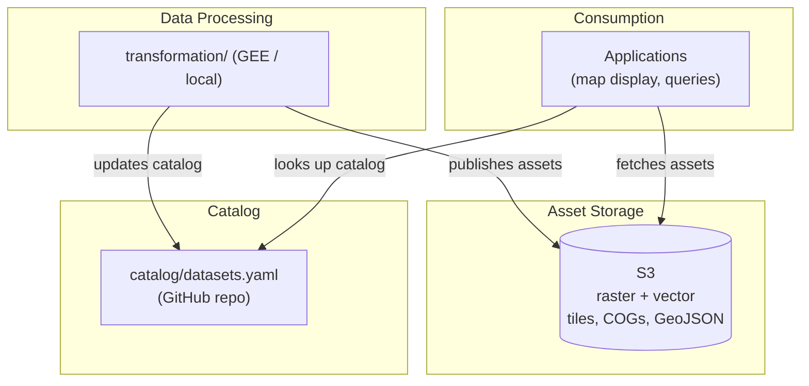

# Geospatial Data Architecture

Architecture for a versioned geospatial catalog that curates raster and vector layers for city-scale mapping and analysis. Designed for offline processing, stable access patterns, and incremental expansion.

---

## Design Principles

- **Versioned catalog** — stable pointers to current datasets while keeping past versions reproducible
- **Offline processing** — no heavy geospatial analysis at request time; precompute and publish
- **Incremental expansion** — add datasets over time without redesigning the system
- **Clear lineage** — metadata on sources, licenses, and methodology

---

## System Architecture



**Relationships:**
- **Data Processing → S3**: Pipelines publish tiles, COGs, and GeoJSON to S3.
- **Data Processing → Catalog**: Pipelines (or manual updates) add/update entries in `catalog/datasets.yaml` in the repo.
- **Applications → Catalog**: Apps read the catalog from the GitHub repo (e.g. raw YAML URL or cloned repo) to discover layers and asset URLs.
- **Applications → S3**: Apps fetch tiles and files directly from S3 using URLs from the catalog.

### Components

| Component | Role |
|-----------|------|
| **Catalog** | `catalog/datasets.yaml` in the repo — source of truth for layers, metadata, and access URLs |
| **Data processing** | GEE or local pipelines; ingest → transform → publish |
| **Asset storage (S3)** | Raster (COGs, tiles) and vector (GeoJSON) — all on S3 for this POC |

---

## Data Flow

```
Raw Data → Offline Transformations → Analytical Layers → Stored (S3)
                                                      → Catalog updated (repo)
Applications → Look up catalog (repo) → Fetch assets (S3)
```

For this POC, all geospatial assets (raster and vector) are stored on S3. The catalog lives in the repo and is looked up directly — no database.

---

## Storage Layout

### Versioned S3 structure

```
s3://oef-geo-catalog/{scope}/{dataset_id}/release/{version}/{period}/
  tiles_visual/{z}/{x}/{y}.png
  tiles_values/{z}/{x}/{y}.png
  {layer}_cog.tif
  {layer}.geojson          # vector outputs
  metadata.json
```

- **scope** — e.g. city name or region
- **version** — dataset/transformation release (e.g. `v1`, `v2`)
- **period** — optional data collection period (e.g. `2024`)

Assets are publicly accessible via S3 URLs (or optionally via CDN). For this POC, both raster and vector outputs are stored on S3.

### Raster vs vector

| Format | Use case | Storage (POC) |
|--------|----------|---------------|
| **Raster** | Dense continuous surfaces (30 m–1 km grids) | S3 (COGs, tiles) |
| **Vector** | Aggregated zone outputs, moderate feature counts | S3 (GeoJSON) |

Dense city-scale grids produce hundreds of thousands of cells — impractical as vector, efficient as raster tiles. Aggregated zone metrics can be published as GeoJSON files on S3.

---

## Catalog Design

### Example catalog entry

| Field | Value |
|-------|-------|
| Dataset ID | `porto_alegre_elevation_30m` |
| Version | v1 |
| Period | 2024 |
| Dataset type | Raster |
| Resolution | 30 m |
| Spatial coverage (bbox) | [-51.27, -30.27, -51.01, -29.93] |
| Source | Copernicus DEM GLO-30 |
| License | Copernicus open data license |
| Visual tile URL | `.../tiles_visual/{z}/{x}/{y}.png` |
| Value tile URL | `.../tiles_values/{z}/{x}/{y}.png` |
| Download (GeoTIFF) | `.../elevation_30m_cog.tif` |
| Latest version | Yes |

### Versioning behaviour

- Each dataset version is immutable and stored under a versioned path
- The catalog maintains a managed **latest** pointer
- Applications choose between stable version pinning or automatic updates

---

## Application Usage

1. **Map display** — load visual tiles for rendering
2. **Interactive queries** — read values from value tiles (Terrain RGB or categorical decode)
3. **Analysis** — download the versioned GeoTIFF

---

## Source Data Considerations

- **Provenance** — document upstream source, license, and access type in the catalog
- **Authoritative vs volunteer** — volunteer sources (e.g. OSM) may be spatially inconsistent; prefer authoritative rasters for production layers where available
- **Resolution and coverage** — match resolution to use case; dense grids → raster; aggregated zones → vector
